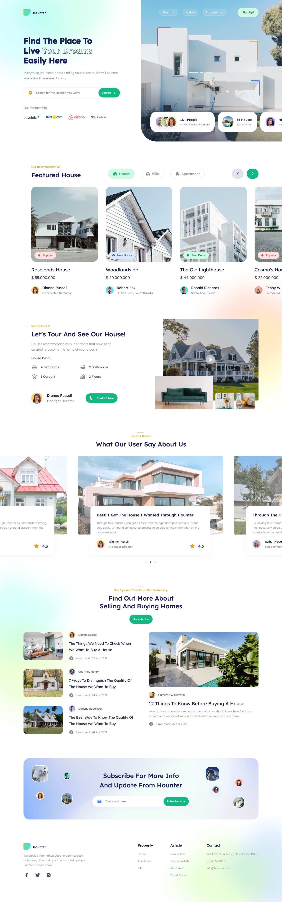

# Hounter

## Table of Content
  1. Decription
  2. Demo
  3. Prerequisites
  4. Installing Hounter
  5. Usage
  6. Technology Stack
  7. Dependencies
  8. Credits
  9. License
  10. Author
  11. Tree


## Decription
In this project a UI design named hounter was coded with HTML, CSS abd Javascript.
Hounter is a completely responsive website that is compatible with all devices, and is built using HTML, CSS, and JavaScript. The hounter landing page can ve used by companies that deal with building and selling of houses.


## Demo
[Hounter UI](https://www.figma.com/community/file/976700468304780404)




## Prerequisites
Before you begin, ensure you have met any of the following requirements:
- [Git](https://git-scm.com/downloads "Download Git") must be installed on your operating system.


## Installing Hounter
To install **Hounter**, follow these steps:

Linux and macOS:
```
sudo git clone https://github.com/kore4lyf/frontend_web-dev.git
```

Windows:
```
git clone https://github.com/kore4lyf/frontend_web-dev.git 
```

**then find the hounter directory.**


## Usage
- Enter the hounter directory
- Open the index.html file on a web browser.
- View/See the webpage.
- Use a text editor to edit code.


## Technology Stack
- HTML (Hypertext Markup Language)
- CSS (Cascading Style Sheet)
- Javascript


## Dependencies
- **Internet**: To load some font from googlefont.
- **Web browser**: To view the webpage.


## Credits
- Edo Yudha - The Hounter UI was designed by Edo Yudha, and it is available for free on [Figma Community](https://www.figma.com/community/file/976700468304780404)


## License 
[MIT](./LICENSE)


## Author
[Korede Faleye](https://www.github.com/kore4lyf/)


## Tree
```
root
|-- css
|   |-- styles.css
|   |-- fontawesome
|   |   |-- all.min.css
|   |   `-- fontawesome.min.css
|   |
|   |-- webfonts
|       |-- fa-v4compatibility.woff2
|       |-- fa-solid-900.woff2
|       `-- and more
|
|-- images
|    |-- house
|    |   |-- article-1.jpg
|    |   `-- and more
|    |
|    |-- profile
|    |    |-- profile-1.png
|    |    `-- and more
|    |
|    |-- logo.png
|    `-- and more
|
|-- js
|   `-- app.js
|
|-- Codeowners
|
|-- Design.png
|-- index.html
|
`-- README.md
```
